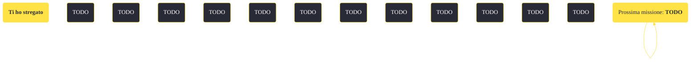

---
# Title, summary, and page position.
linktitle: "Ti ho stregato"
summary: ""
weight: 10
icon: message-question
icon_pack: fas

# Page metadata.
title: "Ti ho stregato"
date: 2022-11-15
type: book # Do not modify.
commentable: true
tags: "Missioni secondarie di Fallout: New Vegas"
hidden: true # Visibile nella sidebar
private: false # Nascosto dalle ricerche
---

*Ti ho stregato* è una missione secondaria di Fallout: New Vegas. È data dal Colonnello James Hsu a Camp McCarran o da Vulpes Inculta al Forte.

<section class="chart-collapse">
<input type="checkbox" name="collapse2" id="handle2">
<h3 class="handle">
<label for="handle2">Clicca per mostrare il diagramma</label>
</h3>

</section>

| Tappe |       Stato        | Descrizione |
|:-----:|:------------------:| ----------- |
|                           10                          |            | Parla con il Capitano Curtis.                                                                                                                                               |
|                           20                          |            | Indaga su attività sospette a Camp McCarran.                                                                                                                                |
|                           30                          |            | Indaga sulle incursioni notturne alla torre di controllo di Camp McCarran.                                                                                                  |
|                           35                          |            | Origlia la trasmissione radiofonica.                                                                                                                                        |
|                           40                          |            | Trova e disinnesca la bomba sulla monorotaia di McCarran prima che il treno abbandoni il terminale.                                                                         |
|                           50                          | :white_check_mark: | Fai rapporto al Colonnello Hsu.                                                                                                                                             |
|                           53                          |            | Cerca di assistere il Capitano Curtis nella sua operazione a Camp McCarran.                                                                                                 |
|                           55                          |            | Offri al Colonnello Hsu il tuo aiuto per trovare la spia.                                                                                                                   |
|                           57                          |            | Riferisci il rifiuto del Colonnello Hsu al Capitano Curtis.                                                                                                                 |
|                           60                          |            | Raccogli gli esplosivi e gli ingredienti per la bomba nel bidone della spazzatura vicino al bancone dei biglietti nell'edificio del terminale di Camp McCarran.             |
|                           65                          |            | Raccogli gli esplosivi nel bidone della spazzatura vicino al bancone dei biglietti nell'edificio del terminale di Camp McCarran.                                            |
|                           70                          |            | Piazza una carica esplosiva in uno sfiatatoio sul lato posteriore della monorotaia di McCarran.                                                                             |
|                           80                          |            | Scendi dal treno e guardalo partire.                                                                                                                                        |
|                           90                          |            | Metti una batteria a fissione, un conduttore, della colla prodigiosa, una scatola di detergente Abraxo e i piani all'interno dell'armadietto del Soldato semplice Crenshaw. |
|                           95                          |            | Uccidi il Soldato semplice Crenshaw.                                                                                                                                        |
|                          100                          |            | Fai rapporto al Colonnello Hsu e incastra il Soldato semplice Crenshaw.                                                                                                     |
|                          110                          | :white_check_mark: | Torna dal Capitano Curtis.                                                                                                                                                  |

**Sfide abilità**:
- **Scienza 45**/**Esplosivi 35**: per disinnescare la bomba alla monorotaia 
- **Furtivo 40**: per uccidere silenziosamente Crenshaw, nel caso si appoggi la Legione

**Note**:
- Il giocatore non dovrà rivelare a Curtis che si stanno facendo delle indagini, altrimenti, successivamente nel gioco, organizzerà un'imboscata e dovrà essere ucciso
- Per incriminare il Soldato semplice Davey Crenshaw è necessario prendere ogni oggetto al cestino
- Lavorando per Caesar per completare Date a Caesar quello che è di Caesar è possibile che l'RNC ci consideri terroristi e che quindi questa missioni sia impossibile da completare, anche perché Hsu, nonostante eventuali camuffamenti, sarà sempre ostile al Corriere 
- Prendendo gli oggetti dal cestino per incolpare Crenshaw, il Corriere conferma di proseguire la missione per conto della Legione e non sarà più possibile utilizzare la monorotaia, anche se l'attentato fallisce 
- Durante la missione *Il dito del sospetto* bisogna riferire a Martina che è stata la Legione a mandare il Corriere a proteggerla e riferire a Vulpes che lavora per Curtis, per ottenere questa missione 

