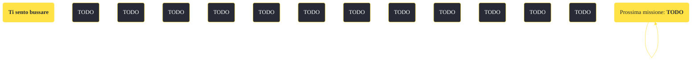

---
# Title, summary, and page position.
linktitle: "Ti sento bussare"
summary: ""
weight: 10
icon: message-question
icon_pack: fas

# Page metadata.
title: "Ti sento bussare"
date: 2022-11-15
type: book # Do not modify.
commentable: true
tags: "Missioni secondarie di Fallout: New Vegas"
hidden: true # Visibile nella sidebar
private: false # Nascosto dalle ricerche
---

*Ti sento bussare* è una missione secondaria di Fallout: New Vegas. È data da Lucius al Forte.

<section class="chart-collapse">
<input type="checkbox" name="collapse2" id="handle2">
<h3 class="handle">
<label for="handle2">Clicca per mostrare il diagramma</label>
</h3>

</section>

| Tappe |       Stato        | Descrizione |
|:-----:|:------------------:| ----------- |
|                           10                          |            | Procurati un meccanismo di sparo di ricambio per l'obice della Legione dai Boomer.                                                                                          |
|                           15                          |            | Recupera il meccanismo di sparo dall'officina dei Boomer.                                                                                                                   |
|                           20                          |            | Installa il meccanismo di sparo di ricambio nell'obice della Legione.                                                                                                       |
|                           30                          | :white_check_mark: | Riferisci a Lucius che l'obice è stato riparato.                                                                                                                            |

