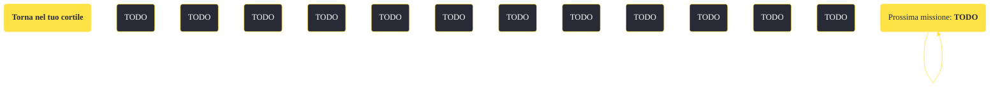

---
# Title, summary, and page position.
linktitle: "Torna nel tuo cortile"
summary: ""
weight: 10
icon: message-question
icon_pack: fas

# Page metadata.
title: "Torna nel tuo cortile"
date: 2022-11-15
type: book # Do not modify.
commentable: true
tags: "Missioni secondarie di Fallout: New Vegas"
hidden: true # Visibile nella sidebar
private: false # Nascosto dalle ricerche
---

*Torna nel tuo cortile* è una missione secondaria di Fallout: New Vegas. È data dal Mercenario Milo a Nelson.

<section class="chart-collapse">
<input type="checkbox" name="collapse2" id="handle2">
<h3 class="handle">
<label for="handle2">Clicca per mostrare il diagramma</label>
</h3>

</section>

| Tappe |       Stato        | Descrizione |
|:-----:|:------------------:| ----------- |
|                           10                          |            | Uccidi gli ostaggi dell'RNC.                                                                                                                                                |
|                           15                          | :white_check_mark: | Torna da Milo al checkpoint dell'RNC.                                                                                                                                       |

**Note**:
- Questa missione fa parte delle attività che il giocatore deve compiere per guadagnare la fiducia di Boone e sbloccare *Mi sono dimenticato di ricordarmi di dimenticare*

