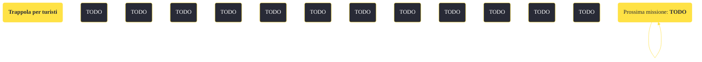

---
# Title, summary, and page position.
linktitle: "Trappola per turisti"
summary: ""
weight: 10
icon: message-question
icon_pack: fas

# Page metadata.
title: "Trappola per turisti"
date: 2022-11-15
type: book # Do not modify.
commentable: true
tags: "Missioni di Honest Hearts"
hidden: true # Visibile nella sidebar
private: false # Nascosto dalle ricerche
---

*Trappola per turisti* è una missione del DLC *Honest Hearts* di Fallout: New Vegas. È data da Joshua Graham all'accampamento dei Cavalli Morti.

<section class="chart-collapse">
<input type="checkbox" name="collapse2" id="handle2">
<h3 class="handle">
<label for="handle2">Clicca per mostrare il diagramma</label>
</h3>

</section>

| Tappe |       Stato        | Descrizione |
|:-----:|:------------------:| ----------- |
|                           10                          |            | Cerca un kit di scorte mediche alla stazione mercenari di Zion.                                                                                                             |
|                           20                          |            | Trova della trementina per il kit di scorte mediche.                                                                                                                        |
|                           30                          |            | Trova del nastro telato per il kit di scorte mediche.                                                                                                                       |
|                           35                          |            | Recupera le parti utilizzabili del kit di scorte mediche presso un falò.                                                                                                    |
|                           40                          |            | Opzionale: Trova del whiskey, della vodka, o dello scotch per sterilizzare il kit di scorte mediche.                                                                        |
|                           50                          |            | Cerca cinque cestini da pranzo Piccoli Scout nell'emporio di Zion.                                                                                                          |
|                           55                          | :white_check_mark: | Trova la chiave della scrivania nell'emporio di Zion.                                                                                                                       |

**Sfide abilità**:
- **Scasso 50**: per scassinare la serratura di una scatola, al cui interno è presente un cestino da pranzo (la chiave è nel registratore di cassa dell'Emporio)
- **Medicina 30**: per controllare il kit medico senza l'uso di altri oggetti

**Note**:
- Tutti i materiali necessari per riparare il kit delle scorte mediche sono all'interno dell'Emporio e saranno disponibili solo dopo aver iniziato la missione

