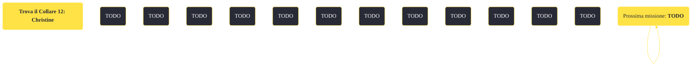

---
# Title, summary, and page position.
linktitle: "Trova il Collare 12: Christine"
summary: ""
weight: 10
icon: message-question
icon_pack: fas

# Page metadata.
title: "Trova il Collare 12: Christine"
date: 2022-11-15
type: book # Do not modify.
commentable: true
tags: "Missioni di Dead Money"
hidden: true # Visibile nella sidebar
private: false # Nascosto dalle ricerche
---

*Trova il Collare 12: Christine* è una missione del DLC *Dead Money* di Fallout:New Vegas. È data da Padre Elijah alla clinica.

<section class="chart-collapse">
<input type="checkbox" name="collapse2" id="handle2">
<h3 class="handle">
<label for="handle2">Clicca per mostrare il diagramma</label>
</h3>

</section>

| Tappe |       Stato        | Descrizione |
|:-----:|:------------------:| ----------- |
|                           10                          |            | Cerca Christine nella clinica del Distretto Medico.                                                                                                                         |
|                           20                          |            | Vai nello scantinato della clinica e spegni gli altoparlanti schermati nell'ala dell'Auto-Doc.                                                                              |
|                           30                          |            | Trova Christine nell'ala Auto-Doc della clinica.                                                                                                                            |
|                           40                          | :white_check_mark: | Arruola Christine.                                                                                                                                                          |

**Note**:
- Una volta completata questa missione, l'esterno della Clinica sarà gremito di fantasmi; è consigliato quindi consegnare un'arma a Christine affinché possa aiutarti 

