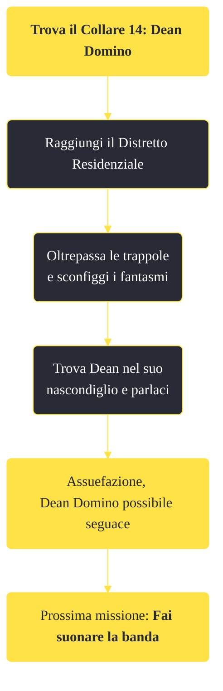

---
# Title, summary, and page position.
linktitle: "Trova il Collare 14: Dean Domino"
summary: ""
weight: 10
icon: message-question
icon_pack: fas

# Page metadata.
title: "Trova il Collare 14: Dean Domino"
date: 2022-11-15
type: book # Do not modify.
commentable: true
tags: "Missioni di Dead Money"
hidden: true # Visibile nella sidebar
private: false # Nascosto dalle ricerche
---

*Trova il Collare 14: Dean Domino* è una missione del DLC *Dead Money* di Fallout:New Vegas. È data da Padre Elijah al distretto residenziale.

<section class="chart-collapse">
<input type="checkbox" name="collapse2" id="handle2">
<h3 class="handle">
<label for="handle2">Clicca per mostrare il diagramma</label>
</h3>

</section>

| Tappe |       Stato        | Descrizione |
|:-----:|:------------------:| ----------- |
|                           10                          |            | Vai da Dean Domino nel suo nascondiglio del Distretto Residenziale.                                                                                                         |
|                           20                          | :white_check_mark: | Arruola Dean Domino.                                                                                                                                                        |

**Sfide abilità**:
- **Esplosivi 25**: per avere una scelta di dialogo aggiuntiva la prima volta che incontriamo Dean
- **Esplosivi 30**: per disarmare i grappoli di granate

**Note**:
- Per non dover uccidere Dean durante la missione *Chiamata alla ribalta al Tampico* è necessario accettare di aiutarlo, parlargli sempre educatamente ed evitare la sfida Baratto, mentre si parla con lui per la prima volta

