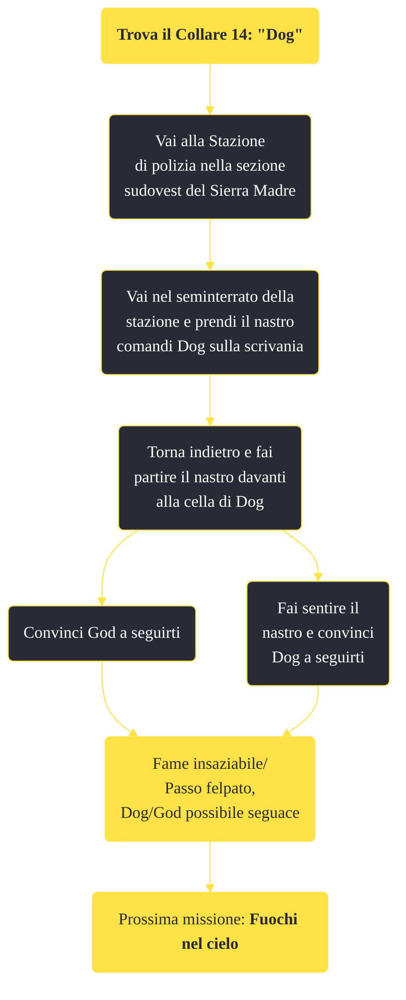

---
# Title, summary, and page position.
linktitle: "Trova il Collare 8: \"Dog\""
summary: ""
weight: 10
icon: message-question
icon_pack: fas

# Page metadata.
title: "Trova il Collare 8: \"Dog\""
date: 2022-11-15
type: book # Do not modify.
commentable: true
tags: "Missioni di Dead Money"
hidden: true # Visibile nella sidebar
private: false # Nascosto dalle ricerche
---

*Trova il Collare 8: "Dog"* è una missione del DLC *Dead Money* di Fallout:New Vegas. È data da Padre Elijah alla stazione di polizia.

<section class="chart-collapse">
<input type="checkbox" name="collapse2" id="handle2">
<h3 class="handle">
<label for="handle2">Clicca per mostrare il diagramma</label>
</h3>

</section>

| Tappe |       Stato        | Descrizione |
|:-----:|:------------------:| ----------- |
|                           10                          |            | Trova Dog alla stazione di polizia della Villa.                                                                                                                             |
|                           20                          |            | Cerca nello scantinato della stazione di polizia un modo per liberare Dog dalla sua cella.                                                                                  |
|                           30                          |            | Riproduci il registro audio dello scantinato sul tuo Pip Boy vicino alla gabbia di Dog.                                                                                     |
|                           40                          | :white_check_mark: | Arruola Dog.                                                                                                                                                                |

**Sfide abilità**:
- 

**Note**:
- Non è possibile completare la missione "neutralmente" per Dog/God: se non sei pronto a reclutare Dog, meglio che parlarci 

