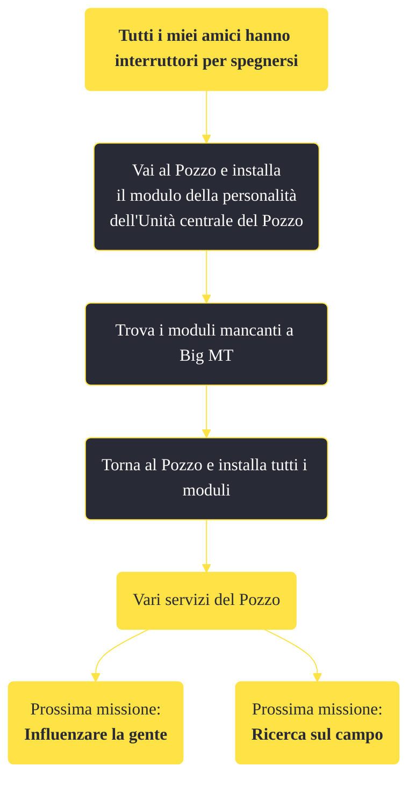

---
# Title, summary, and page position.
linktitle: "Tutti i miei amici hanno interruttori per spegnersi" 
summary: ""
weight: 10
icon: message-question
icon_pack: fas

# Page metadata.
title: "Tutti i miei amici hanno interruttori per spegnersi"
date: 2022-11-15
type: book # Do not modify.
commentable: true
tags: "Missioni di Old World Blues"
hidden: true # Visibile nella sidebar
private: false # Nascosto dalle ricerche
---

*Tutti i miei amici hanno interruttori per spegnersi* è una missione del DLC *Old World Blues* di Fallout: New Vegas. È data dal Pozzo.

**Riassunto**:
1. Vai al Pozzo e installa il modulo della personalità dell'Unità centrale del Pozzo
2. Trova i moduli mancanti a Big MT
3. Torna al Pozzo e installa tutti i moduli
4. Ricompensa: vari servizi del Pozzo
5. Prossime missioni: *Influenzare la gente*, *Ricerca sul campo*

<section class="chart-collapse">
<input type="checkbox" name="collapse2" id="handle2">
<h3 class="handle">
<label for="handle2">Clicca per mostrare il diagramma</label>
</h3>

</section>

| Tappe |       Stato        | Descrizione |
|:-----:|:------------------:| ----------- |
|                           1                           |            | Raggiungi il Pozzo e installa l'Unità centrale.                                                                                                                             |
|                           5                           |            | Trova i moduli di personalità perduti.                                                                                                                                      |
|                           10                          |            | Trova i moduli perduti per il Pozzo, l'Auto-Doc e la Stazione di ricerca biologica.                                                                                         |
|                           15                          |            | Trova il primo set di moduli di personalità per il Pozzo.                                                                                                                   |
|                           20                          |            | Trova i moduli perduti per gli Interruttori della luce e il Jukebox.                                                                                                        |
|                           25                          |            | Trova il secondo set di moduli di personalità per il Pozzo.                                                                                                                 |
|                           30                          |            | Trova i moduli perduti per il Tostapane, Muggy e l'Iconoclasta.                                                                                                             |
|                           35                          |            | Trova il terzo set di moduli di personalità per il Pozzo.                                                                                                                   |
|                           40                          | :white_check_mark: | Installa i moduli di personalità nel Pozzo.                                                                                                                                 |

**Note**:
- Devi ottenere i moduli, sparsi per tutto Big MT, dopo aver installato quello dell'Unità centrale del Pozzo:
  - il modulo mancante per il Lavello è nelle caverne del Complesso magnetoidraulico
  - il modulo mancante per l'Auto-Doc del Pozzo è nell'Edificio medico Y-17
  - il modulo mancante per la Stazione di ricerca biologica è nel Giardino botanico X-22
  - il modulo mancante per il Jukebox è nell'abitazione #108 dell'Higgs Village
  - il modulo mancante per l'Iconoclasta è nell'abitazione #101 dell'Higgs Village
  - il modulo mancante per l'Interruttore della luce 01 è nell'Impianto delle antenne di trasmissione X-2
  - il modulo mancante per l'Interruttore della luce 02 è nascosto all'interno del Tunnel settentrionale di Big MT
  - il modulo mancante per Muggy è nei pressi di un camion all'Impianto di decostruzione Securitron
  - il modulo mancante per il Tostapane è all'interno del Nido del cuculo

