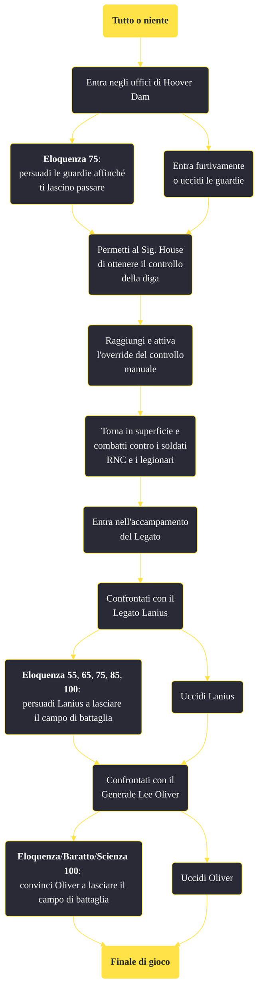

---
# Title, summary, and page position.
linktitle: "Tutto o niente"
summary: ""
weight: 10
icon: message-question
icon_pack: fas

# Page metadata.
title: "Tutto o niente"
date: 2022-11-15
type: book # Do not modify.
commentable: true
tags: "Missioni principali di Fallout: New Vegas"
hidden: true # Visibile nella sidebar
private: false # Nascosto dalle ricerche
---

*Tutto o niente* è una missione principale di Fallout: New Vegas. È data dal Sig. House a Hoover Dam.

**Riassunto**:
1. Entra negli uffici di Hoover Dam
   - **Eloquenza 75**:  persuadi le guardie affinché ti lascino passare
   - Entra furtivamente o uccidi le guardie
2. Permetti al Sig. House di ottenere il controllo della diga
3. Raggiungi e attiva l'override del controllo manuale
4. Torna in superficie e combatti contro i soldati RNC e i legionari
5. Entra nell'accampamento del Legato
6. Confrontati con il Legato Lanius
   - **Eloquenza 55**, **65**, **75**, **85**, **100**: persuadi Lanius a lasciare il campo di battaglia
   - Uccidi Lanius
7.  Confrontati con il Generale Lee Oliver
   -  **Eloquenza**/**Baratto**/**Scienza 100**: convinci Oliver a lasciare il campo di battaglia
   -  Uccidi Oliver
8.  Ricompensa: *Finale di gioco*

<section class="chart-collapse">
<input type="checkbox" name="collapse2" id="handle2">
<h3 class="handle">
<label for="handle2">Clicca per mostrare il diagramma</label>
</h3>

</section>

| Tappe |       Stato        | Descrizione |
|:-----:|:------------------:| ----------- |
|                           10                          |            | Vai nella sala di controllo di Hoover Dam e installa il chip comandi manuali.                                                                                               |
|                           20                          |            | Attiva la centrale elettrica orientale per alimentare l'esercito di Securitron.                                                                                             |
|                           30                          |            | Esci dal lato orientale della diga.                                                                                                                                         |
|                           40                          |            | Dirigiti all'accampamento del Legato e occupati del Legato e della Legione di Caesar.                                                                                       |
|                           50                          |            | Occupati del Generale Oliver e dell'RNC.                                                                                                                                    |
|                           90                          | :white_check_mark: | Torna dal Sig. House con le notizie della tua vittoria.                                                                                                                     |

**Sfide abilità**:
- **Eloquenza 75**: per persuadere i due soldati armati di inceneritori
- **Eloquenza 55**, **65**, **75**, **85**, **100**: per convincere Lanius a lasciare il campo di battaglia
- **Baratto 100**: parlando con Lanius (lo renderà ostile)
- **Eloquenza**/**Baratto**/**Scienza 100**: per convincere il Generale Lee Oliver a lasciare il campo di battaglia

