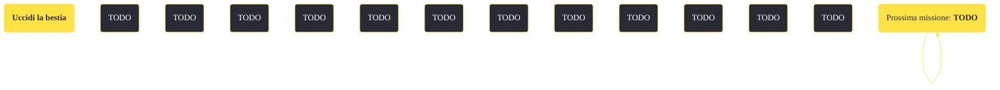

---
# Title, summary, and page position.
linktitle: "Uccidi la bestia"
summary: ""
weight: 10
icon: message-question
icon_pack: fas

# Page metadata.
title: "Uccidi la bestia"
date: 2022-11-15
type: book # Do not modify.
commentable: true
tags: "Missioni di Dead Money"
hidden: true # Visibile nella sidebar
private: false # Nascosto dalle ricerche
---

*Uccidi la bestia* è una missione del DLC *Dead Money* di Fallout:New Vegas. È data da Padre Elijah alla Cantina Madrid nel Casinò Sierra Madre.

<section class="chart-collapse">
<input type="checkbox" name="collapse2" id="handle2">
<h3 class="handle">
<label for="handle2">Clicca per mostrare il diagramma</label>
</h3>

</section>

| Tappe |       Stato        | Descrizione |
|:-----:|:------------------:| ----------- |
|                           5                           |            | Accedi all'armadietto dei contatori del casinò e ripristina la corrente al resto del Sierra Madre.                                                                          |
|                           10                          |            | Trova la chiave della porta di emergenza per la cucina della Cantina Madrid.                                                                                                |
|                           20                          |            | Accedi alla cucina della cantina Madrid attraverso la porta di emergenza del casinò.                                                                                        |
|                           30                          |            | Ripara le tre valvole del gas rotte nella cucina senza essere visto da Dog.                                                                                                 |
|                           40                          | :white_check_mark: | Confrontati con Dog e convincilo a tornare sulla sua posizione, in una maniera o nell'altra.                                                                                |
|                           50                          |            | Uccidi Dog.                                                                                                                                                                 |
|                           60                          | :white_check_mark: | Esci dalla cucina prima che il collare di Dog esploda e faccia esplodere anche il tuo.                                                                                      |

**Sfide abilità**:
- **Eloquenza 50**: per convincere Dog a togliersi il collare, facendosi esplodere
- **Eloquenza 75**: per sopprimere la personalità di Dog e far prevalere God
- **Eloquenza 85**: per fondere le due personalità

**Note**:
- Con il "nastro comandi Dog" è possibile conversare con Dog/God dalla distanza 

