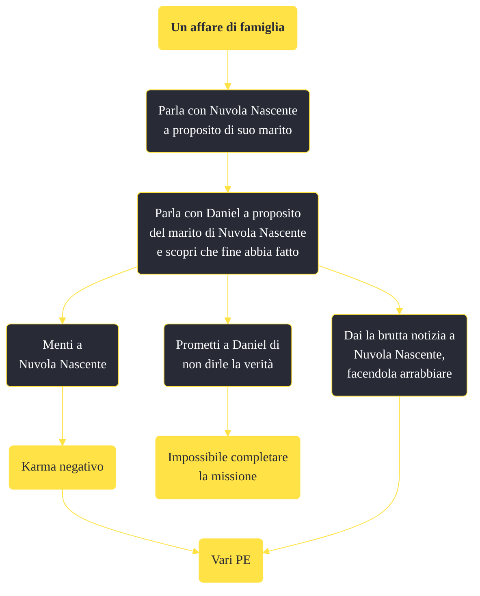

---
# Title, summary, and page position.
linktitle: "Un affare di famiglia"
summary: ""
weight: 10
icon: message-question
icon_pack: fas

# Page metadata.
title: "Un affare di famiglia"
date: 2022-11-15
type: book # Do not modify.
commentable: true
tags: "Missioni di Honest Hearts"
hidden: true # Visibile nella sidebar
private: false # Nascosto dalle ricerche
---

*Un affare di famiglia* è una missione del DLC *Honest Hearts* di Fallout: New Vegas. È data da Nuvola Crescente all'accampamento dei Tormenti.

<section class="chart-collapse">
<input type="checkbox" name="collapse2" id="handle2">
<h3 class="handle">
<label for="handle2">Clicca per mostrare il diagramma</label>
</h3>

</section>

| Tappe |       Stato        | Descrizione |
|:-----:|:------------------:| ----------- |
|                           10                          |            | Scopri cosa sa Daniel della famiglia di Nuvola Nascente.                                                                                                                    |
|                           20                          | :white_check_mark: | Parla a Nuvola Nascente della sua famiglia.                                                                                                                                 |

**Note**:
- È possibile svolgere questa missione solo quando Nuvola Nascente è un tuo seguace

