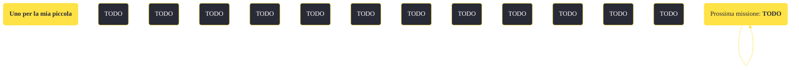

---
# Title, summary, and page position.
linktitle: "Uno per la mia piccola"
summary: ""
weight: 10
icon: message-question
icon_pack: fas

# Page metadata.
title: "Uno per la mia piccola"
date: 2022-11-15
type: book # Do not modify.
commentable: true
tags: "Missioni secondarie di Fallout: New Vegas"
hidden: true # Visibile nella sidebar
private: false # Nascosto dalle ricerche
---

*Uno per la mia piccola* è una missione secondaria di Fallout: New Vegas. È data da Boone a Novac.

<section class="chart-collapse">
<input type="checkbox" name="collapse2" id="handle2">
<h3 class="handle">
<label for="handle2">Clicca per mostrare il diagramma</label>
</h3>

</section>

| Tappe |       Stato        | Descrizione |
|:-----:|:------------------:| ----------- |
|                           10                          |            | (Opzionale) Cerca a Novac informazioni sull'autore del rapimento della moglie di Boone.                                                                                     |
|                           20                          |            | (Opzionale) Cerca prove sul colpevole nell'ingresso del Dino Dee-lite.                                                                                                      |
|                           30                          |            | Manda qualcuno davanti a Dinky the Dinosaur. Mettiti il berretto per segnalare a Boone che è lui il colpevole.                                                              |
|                           40                          | :white_check_mark: | Torna da Boone.                                                                                                                                                             |

**Sfide abilità**:
- **Eloquenza 55**: per persuadere Boone che il bersaglio, nonostante fosse sbagliato, era quello giusto

**Note**:
- Questa missione non sarà ottenibile se hai una cattiva reputazione con l'RNC 
- Se usi il Berretto 1° Ricognitori per riparare un altro berretto, questa missione non sarà più completabile 
- Dopo la morte di Alice, sarà Cliff Briscoe ad adempiere alle sue mansioni, come quella della vendita di una camera dell'hotel (non appena la reputazione con Novac sarà buona)

