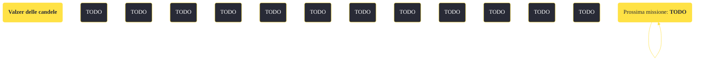

---
# Title, summary, and page position.
linktitle: "Valzer delle candele"
summary: ""
weight: 10
icon: message-question
icon_pack: fas

# Page metadata.
title: "Valzer delle candele"
date: 2022-11-15
type: book # Do not modify.
commentable: true
tags: "Missioni secondarie di Fallout: New Vegas"
hidden: true # Visibile nella sidebar
private: false # Nascosto dalle ricerche
---

*Valzer delle candele* è una missione secondaria di Fallout: New Vegas. È data da Arcade Gannon.

<section class="chart-collapse">
<input type="checkbox" name="collapse2" id="handle2">
<h3 class="handle">
<label for="handle2">Clicca per mostrare il diagramma</label>
</h3>

</section>

| Tappe |       Stato        | Descrizione |
|:-----:|:------------------:| ----------- |
|                           10                          |            | Insieme ad Arcade, convinci i Superstiti a riunirsi per un'ultima battaglia.                                                                                                |
|                           11                          |            | Chiedi al Dottor Henry di venire alla riunione dei Superstiti.                                                                                                              |
|                           12                          |            | Chiedi a Daisy Whitman di venire alla riunione dei Superstiti.                                                                                                              |
|                           13                          |            | Chiedi a Cannibal Johnson di venire alla riunione dei Superstiti.                                                                                                           |
|                           14                          |            | Chiedi a Orion Moreno di venire alla riunione dei Superstiti.                                                                                                               |
|                           15                          |            | Chiedi a Judah Kreger di venire alla riunione dei Superstiti.                                                                                                               |
|                           20                          |            | Ottieni accesso al bunker dei Superstiti.                                                                                                                                   |
|                           30                          |            | Chiedi ai Superstiti di sostenere la lotta contro la Legione o l'RNC.                                                                                                       |
|                           35                          |            | Cerca di convincere Orion Moreno a rimanere.                                                                                                                                |
|                           36                          |            | Uccidi Orion Moreno per recuperare la chiave per il passaggio al controllo manuale della porta.                                                                             |
|                           37                          |            | Riferisci a Judah Kreger cosa è accaduto a Orion Moreno.                                                                                                                    |
|                           38                          |            | Ricevi l'addestramento per l'Armatura atomica da Daisy Whitman.                                                                                                             |
|                           45                          |            | Ricevi l'addestramento per l'Armatura atomica da Orion Moreno.                                                                                                              |
|                           50                          | :white_check_mark: | Lascia la sala di comando dei Superstiti in modo che possano pianificare la prossima battaglia.                                                                             |

**Sfide abilità**:
- **Eloquenza 80**: per convincere Moreno a non andarsene (nel caso non si avesse un alto livello di infamia per l'RNC)

**Note**:
- Per poter iniziare la missione bisogna aver compiuto una delle seguenti azioni, nella trama principale del gioco:
  - distrutto la Confraternita d'Acciaio nella missione La Casa vince sempre, V
  - installato Yes Man nel computer centrale del Lucky 38, in Jolly: Cambiamento di gestione
  - riportare la morte del Sig. House al Colonnello Cassandra Moore, durante Per la Repubblica, 2ª parte 
- Successivamente, bisogna guadagnare la "fiducia" di Arcade Gannon. Nel gioco essa viene espressa in forma numerica e un numero definito di eventi ed azioni farà guadagnare 1 o 2 punti "fiducia". Il valore minimo di fiducia da raggiungere è 5 ed è possibile guadagnarla con le seguenti azioni:
  - andando al Vertibird schiantato, alla Sede REPCONN o al Forte (1); al Forte, parlando con Arcade, scegliendo:
    - "Limitiamoci ad ascoltarlo, capire cosa sta architettando e andarcene di qui." (2)
    - "Voglio solo ascoltare Caesar." (1)
    - "Con il casino che c'è a New Vegas, credi davvero che Caesar non abbia nulla da offrire?" seguito da "Sto solo cercando di avere una mentalità aperta." (1); [È possibile perdere Arcade definitivamente a questo punto, rendendo impossibile continuare la missione]
  - parlando con il Dott. Thomas Hildern, a Camp McCarran; Arcade chiederà al Corriere la sua opinione su Hildern, selezionando:
    - "Meno male che ci sono ancora persone come te." (2)
    - "Sono certo che lo dica in senso positivo." (2) 
  - durante la missione Quel vecchio Sole fortunato, quando Arcade suggerisce di erogare l'energia a Freeside e Westside:
    - appoggiando la sua scelta (1)
    - convincendolo con una sfida Intelligenza 7 a distribuire l'energia a tutta la regione (1) 
  - durante la missione Dissimulazione:
    - dicendo "Se lo dici tu, non discuto.", quando menziona Anderson (1)
    - completandola e dando la colpa agli Scorpioni e lasciando andare Tom (2)
    - inventando una falsa lotta con Dazzle e lasciando quindi Westside a prelevare illegalmente l'acqua dall'RNC (1)
    - uccidendo Anderson e passando una sfida Intelligenza 7 dicendo "Stai facendo supposizioni senza prove, cerca di essere più razionale." e "Così è meglio, senza coinvolgere l'RNC né mettere in contatto Anderson con i locali." (2) 
- Se si sceglie di spalleggiare Caesar nella missione finale, Kreger, Johnson e Arcade se ne andranno, senza possibilità di convincerli a restare 

