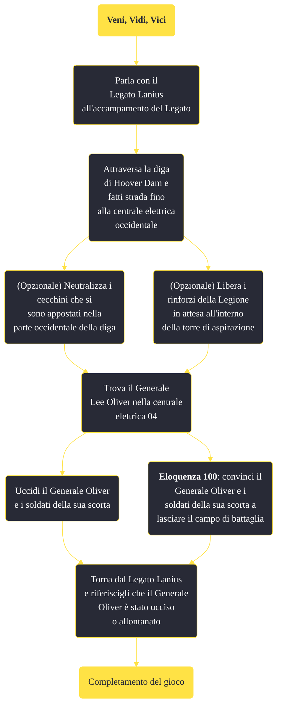

---
# Title, summary, and page position.
linktitle: "Veni, Vidi, Vici"
summary: ""
weight: 10
icon: message-question
icon_pack: fas

# Page metadata.
title: "Veni, Vidi, Vici"
date: 2022-11-15
type: book # Do not modify.
commentable: true
tags: "Missioni principali di Fallout: New Vegas"
hidden: true # Visibile nella sidebar
private: false # Nascosto dalle ricerche
---

*Veni, Vidi, Vici* è una missione principale di Fallout: New Vegas. È data dal Legato Lanius all'accampamento del Legato.

**Riassunto**:
1. Parla con il Legato Lanius all'accampamento del Legato
2. Attraversa la diga di Hoover Dam e fatti strada fino alla centrale elettrica occidentale
   - (Opzionale) Neutralizza i cecchini che si sono appostati nella parte occidentale della diga"
   - (Opzionale) Libera i rinforzi della Legione in attesa all'interno della torre di aspirazione"
3. Trova il Generale Lee Oliver nella centrale elettrica 04
   - Uccidi il Generale Oliver e i soldati della sua scorta
   - **Eloquenza 100**: convinci il Generale Oliver e i soldati della sua scorta a lasciare il campo di battaglia
4. Torna dal Legato Lanius e riferiscigli che il Generale Oliver è stato ucciso o allontanato
5. Ricompensa: *Finale di gioco*

<section class="chart-collapse">
<input type="checkbox" name="collapse2" id="handle2">
<h3 class="handle">
<label for="handle2">Clicca per mostrare il diagramma</label>
</h3>

</section>

| Tappe |       Stato        | Descrizione |
|:-----:|:------------------:| ----------- |
|                           10                          |            | Attraversa la diga e fatti strada fino alla centrale elettrica occidentale.                                                                                                 |
|                           11                          |            | (Opzionale) Neutralizza i cecchini che si sono appostati nella parte occidentale della diga.                                                                                |
|                           12                          |            | (Opzionale) Libera i rinforzi della Legione in attesa all'interno della torre di aspirazione.                                                                               |
|                           20                          |            | Trova il comandante nemico, il Generale Oliver.                                                                                                                             |
|                           30                          |            | Uccidi il Generale Oliver e i soldati della sua scorta.                                                                                                                     |
|                           40                          | :white_check_mark: | Torna dal Legato e riferiscigli che il Generale Oliver è stato allontanato.                                                                                                 |
|                           41                          | :white_check_mark: | Torna dal Legato e riferiscigli che il Generale Oliver è stato ucciso.                                                                                                      |

**Sfide abilità**:
- **Eloquenza 100**: per convincere il Generale Oliver a lasciare il campo di battaglia

