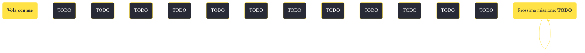

---
# Title, summary, and page position.
linktitle: "Vola con me"
summary: ""
weight: 10
icon: message-question
icon_pack: fas

# Page metadata.
title: "Vola con me"
date: 2022-11-15
type: book # Do not modify.
commentable: true
tags: "Missioni secondarie di Fallout: New Vegas"
hidden: true # Visibile nella sidebar
private: false # Nascosto dalle ricerche
---

*Vola con me* è una missione secondaria di Fallout: New Vegas. È data da Manny Vargas o da Noonan No-bark a Novac e da Jason Bright al sito test REPCONN.

<section class="chart-collapse">
<input type="checkbox" name="collapse2" id="handle2">
<h3 class="handle">
<label for="handle2">Clicca per mostrare il diagramma</label>
</h3>

</section>

| Tappe |       Stato        | Descrizione |
|:-----:|:------------------:| ----------- |
|                           5                           |            | Dirigiti alla struttura REPCONN ad ovest di Novac per indagare sulle voci di attività ghoul.                                                                                |
|                           10                          |            | Entra nella struttura e trova l'origine dei ghoul.                                                                                                                          |
|                           15                          |            | Dirigiti al piano superiore per incontrare il proprietario della voce dell'intercom.                                                                                        |
|                           20                          |            | Parla con Jason Bright, il leader dei ghoul REPCONN.                                                                                                                        |
|                           21                          |            | Dirigiti nello scantinato della REPCONN e parla con Jason Bright riguardo alle prossime mosse.                                                                              |
|                           30                          |            | Parla con Chris Haversam della riparazione dei razzi.                                                                                                                       |
|                           40                          |            | Trova il combustibile atomico per i razzi.                                                                                                                                  |
|                           41                          |            | Torna alla struttura per razzi e dai il carburante a Chris Haversam.                                                                                                        |
|                           50                          |            | Trova pezzi per riparare i controller di propulsione dei razzi.                                                                                                             |
|                           51                          |            | Torna alla struttura per razzi e dai i pezzi a Chris Haversam.                                                                                                              |
|                           60                          |            | Sbarazzati dei Nightkin nello scantinato.                                                                                                                                   |
|                           61                          |            | (Opzionale) Perquisisci la stanza vicina alla ricerca del carico di Stealth Boy che cercano i Nightkin.                                                                     |
|                           62                          |            | Riferisci a Jason Bright che i Nightkin non ci sono più.                                                                                                                    |
|                           63                          |            | (Opzionale) Trova l'amico di Harland imprigionato dai Nightkin.                                                                                                             |
|                           64                          |            | (Opzionale) Torna da Harland e comunicagli le cattive notizie.                                                                                                              |
|                           65                          |            | (Opzionale) Trova il leader dei "demoni" e parla con lui.                                                                                                                   |
|                           69                          |            | (Opzionale) Torna da Davison e avvertilo che gli Stealth Boy non sono nell'impianto REPCONN.                                                                                |
|                           70                          |            | Parla con Chris Haversam per cominciare i preparativi per il lancio del razzo.                                                                                              |
|                           80                          |            | (Opzionale) Porta 3 bombe di zucchero a Chris Haversam.                                                                                                                     |
|                           90                          | :white_check_mark: | (Opzionale) Sabota i razzi per farli schiantare durante il lancio.                                                                                                          |
|                          100                          | :white_check_mark: | Dirigiti alla piattaforma di avvistamento e completa la sequenza di lancio.                                                                                                 |

**Sfide abilità**:
- **Donnaiolo**/**Eloquenza 50**/**Baratto 50**: per ottenere gratuitamente (o spedendendo solo 250 tappi) i moduli di comando propulsione dell'Anziana signora Gibson
- **Eloquenza 50**/**Vedova nera**: per convincere Haversam a sabotare i razzi
- **Scienza 40**: per chiedere a Cliff se i dinosauri souvenir contengono materiale radioattivo
- **Scienza 55**/**Intelligenza < 3**: per alterare le coordinate della traiettoria dei razzi
- **Baratto 30**: per comprare la chiave del ripostiglio di Cliff

**Note**:
- Offendere Davison o toccare il teschio di bramino sulla sua scrivania lo renderà immediatamente ostile
- Nell'area di lancio sono disponibili una tuta spaziale con relativo elmo e alcune droghe
- Alcune scatole di bombe di zucchero si possono trovare:
  - in una scatola su uno scaffale nella casa del Dott. Mitchell a Goodsprings
  - nella stazione di rifornimento di Goodsprings
  - a Nipton, nella casa in cui si è riparato Boxcars
  - nell'inventario dell'Anziana signora Gibson
  - in vendita da Cliff Briscoe a Novac
  - nel Negozio di Mick e Ralph a Freeside
- Guadagni solo 200 PE se aiuti in maniera pacifica Davison e Harland, mentre guadagna 300 PE uccidendo quest'ultimo

