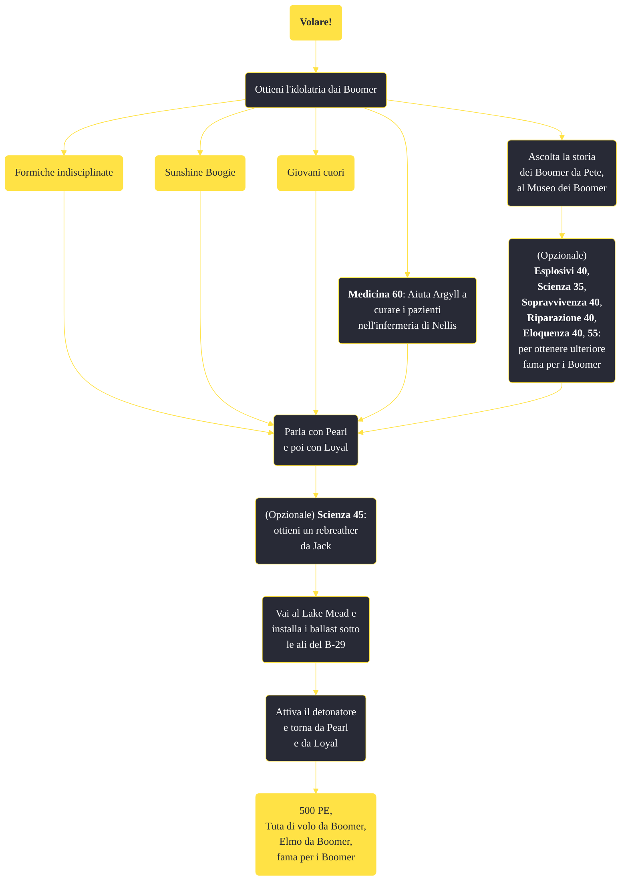

---
# Title, summary, and page position.
linktitle: "Volare!"
summary: ""
weight: 10
icon: message-question
icon_pack: fas

# Page metadata.
title: "Volare!"
date: 2022-11-15
type: book # Do not modify.
commentable: true
tags: "Missioni secondarie di Fallout: New Vegas"
hidden: true # Visibile nella sidebar
private: false # Nascosto dalle ricerche
---

*Volare!* è una missione secondaria di Fallout: New Vegas. È data da Pearl alla base aeronautica di Nellis.

**Riassunto**:
1. Ottieni l'idolatria dai Boomer
   - Completa *Formiche indisciplinate*
   - Completa *Sunshine Boogie*
   - Completa *Giovani cuori*
   - **Medicina 60**: Aiuta Argyll a curare i pazienti nell'infermeria di Nellis
   - Ascolta la storia dei Boomer da Pete, al Museo dei Boomer
      - (Opzionale) **Esplosivi 40**, **Scienza 35**, **Sopravvivenza 40**, **Riparazione 40**, **Eloquenza 40**, **55**: per ottenere ulteriore **fama per i Boomer**
2. Parla con Pearl e poi con Loyal
3. (Opzionale) **Scienza 45**: ottieni un rebreather da Jack
4.  Vai al Lake Mead e installa i ballast sotto le ali del B-29
5.  Attiva il detonatore e torna da Pearl e da Loyal
6. Ricompensa: **500 PE**, **Tuta di volo da Boomer**, **Elmo da Boomer**, **fama per i Boomer**

<section class="chart-collapse">
<input type="checkbox" name="collapse2" id="handle2">
<h3 class="handle">
<label for="handle2">Clicca per mostrare il diagramma</label>
</h3>

</section>

| Tappe |       Stato        | Descrizione |
|:-----:|:------------------:| ----------- |
|                           25                          |            | Aiuta i Boomer nei pressi di Nellis.                                                                                                                                        |
|                           30                          |            | Torna da Pearl.                                                                                                                                                             |
|                           35                          |            | Parla con Loyal del piano dei Boomer di recuperare il bombardiere dal fondo del lago di Lake Mead.                                                                          |
|                           40                          |            | Attacca il ballast del Loyal al B-29 sul fondo del Lake Mead.                                                                                                               |
|                           42                          |            | (Opzionale) Parla con Jack della possibilità di procurarsi un rebreather per nuotare sul fondo del Lake Mead.                                                               |
|                           43                          |            | (Opzionale) Jack ha bisogno di alcuni pezzi di pentola a pressione per terminare il suo rebreather.                                                                         |
|                           45                          |            | Torna alla riva vicino all'argano di traino e usa il detonatore di Loyal per riportare il B-29 in superficie.                                                               |
|                           50                          |            | Torna da Loyal per informarlo che il B-29 è risalito dal fondo del lago.                                                                                                    |
|                           55                          | :white_check_mark: | Riferisci a Pearl che hai completato il tuo lavoro.                                                                                                                         |

**Sfide abilità**:
- **Medicina 60**: per curare i pazienti nell'infermeria di Nellis
- **Scienza 45**: per ottenere il rebrether da Jack

**Note**:
- È necessario completare questa missione se si vuole ottenere l'appoggio dei Boomer nella battaglia finale su Hoover Dam
- Completando questa missione, assieme alle missioni per Yes Man, sarà possibile intimorire il Generale Lee Oliver, durante la missione *Niente dei, niente padroni*, minacciando un intervento d'artiglieria sulla diga
- Conclusa la missione non sarà più possibile donare razzi souvenir ai Mini Boomer 

