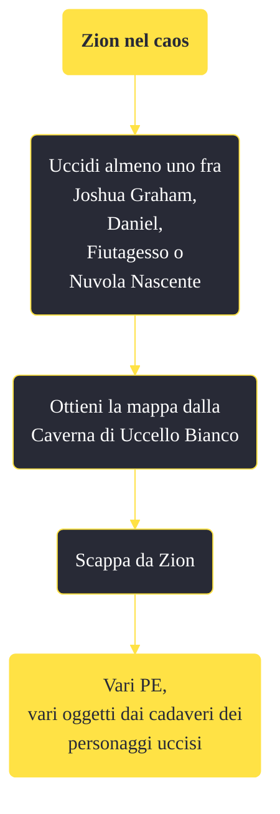

---
# Title, summary, and page position.
linktitle: "Zion nel caos"
summary: ""
weight: 10
icon: message-question
icon_pack: fas

# Page metadata.
title: "Zion nel caos"
date: 2022-11-15
type: book # Do not modify.
commentable: true
tags: "Missioni di Honest Hearts"
hidden: true # Visibile nella sidebar
private: false # Nascosto dalle ricerche
---

*Zion nel caos* è una missione del DLC *Honest Hearts* di Fallout: New Vegas. È data dal Pip-Boy.

**Riassunto**:
1. Uccidi almeno uno fra Joshua Graham, Daniel, Fiutagesso o Nuvola Nascente
2. Ottieni la mappa dalla Caverna di Uccello Bianco
3. Scappa da Zion
4. Ricompensa: **vari PE**, vari oggetti dai cadaveri dei personaggi uccisi

<section class="chart-collapse">
<input type="checkbox" name="collapse2" id="handle2">
<h3 class="handle">
<label for="handle2">Clicca per mostrare il diagramma</label>
</h3>

</section>

| Tappe |       Stato        | Descrizione |
|:-----:|:------------------:| ----------- |
|                           10                          |            | Recupera la mappa del Canyon di Zion.                                                                                                                                       |
|                           15                          | :white_check_mark: | Abbandona Zion e torna nella Zona contaminata del Mojave.                                                                                                                   |

**Note**:
- Non è necessario completare questa missione; essa viene attivata solo quando il giocatore uccide uno dei personaggi principali del DLC
- Iniziando questa missione sarà impossibile completare le altre e ottenere i relativi trofei/obiettivi

